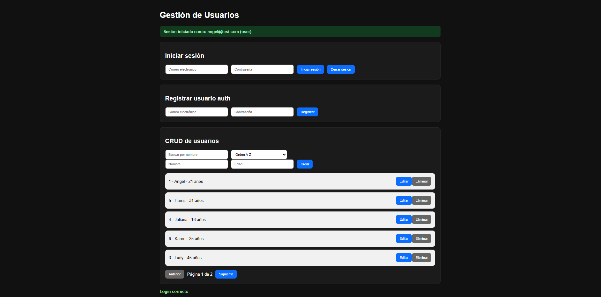
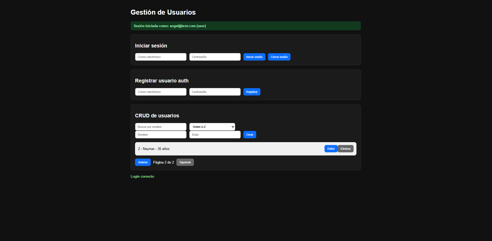
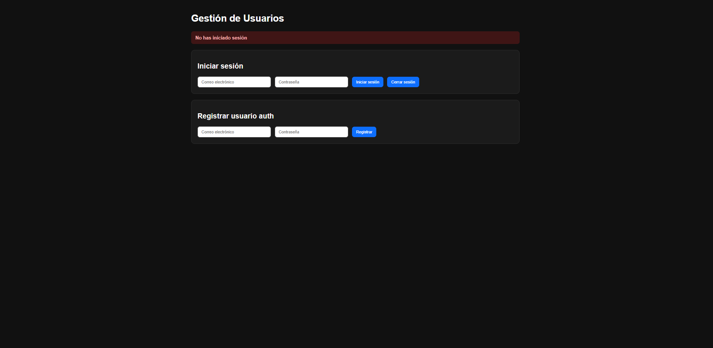

# User Management API

A secure user management project built with Node.js, Express, PostgreSQL and JWT authentication. It includes a REST API, role-based access control, audit logging, security middleware and a small frontend interface to test authentication and CRUD operations.

## Screenshots

### Authenticated user dashboard



### Paginated user list



### Logged out state



## Features

- User registration and login with JWT authentication.
- Protected user CRUD endpoints.
- Role-based authorization middleware.
- PostgreSQL database with relational tables.
- Password hashing with bcrypt.
- Search, ordering and pagination in the frontend.
- Audit table for tracking important user actions.
- Security middleware with Helmet, CORS and rate limiting.
- Static frontend included for testing the API from the browser.

## Tech Stack

- Node.js
- Express.js
- PostgreSQL
- JWT
- bcrypt
- Helmet
- CORS
- express-rate-limit
- HTML, CSS and JavaScript frontend

## Project Structure

```text
user-management-api/
|-- config/
|   `-- db.js
|-- controllers/
|   |-- auth.controller.js
|   `-- usuarios.controller.js
|-- database/
|   `-- schema.sql
|-- frontend/
|   |-- app.js
|   |-- index.html
|   `-- style.css
|-- middlewares/
|   |-- auth.middleware.js
|   `-- role.middleware.js
|-- routes/
|   |-- auth.routes.js
|   `-- usuarios.routes.js
|-- utils/
|   `-- auditoria.js
|-- docs/
|   `-- screenshots/
|-- package.json
|-- server.js
`-- README.md
```

## Getting Started

### 1. Install dependencies

```bash
npm install
```

### 2. Configure environment variables

Create a `.env` file in the project root:

```env
PORT=3000
DB_USER=postgres
DB_HOST=localhost
DB_NAME=mi_app
DB_PASSWORD=your_password
DB_PORT=5432
JWT_SECRET=your_long_secure_secret
ALLOWED_ORIGINS=http://127.0.0.1:5500,http://localhost:5500
NODE_ENV=development
```

### 3. Create the database tables

Run the SQL schema against your PostgreSQL database:

```bash
psql -U postgres -d mi_app -f database/schema.sql
```

### 4. Start the backend

```bash
npm run dev
```

The API will run at:

```text
http://localhost:3000
```

### 5. Open the frontend

Open `frontend/index.html` with Live Server or another static server.

## API Endpoints

### Authentication

| Method | Endpoint | Description |
| --- | --- | --- |
| POST | `/auth/register` | Register an authentication user |
| POST | `/auth/login` | Login and receive a JWT token |

### Users

| Method | Endpoint | Description |
| --- | --- | --- |
| GET | `/usuarios` | List users |
| POST | `/usuarios` | Create a user |
| PUT | `/usuarios/:id` | Update a user |
| DELETE | `/usuarios/:id` | Delete a user |

## Database Tables

### `usuarios`

Stores application users managed through CRUD operations.

### `auth_users`

Stores authentication accounts with hashed passwords and roles.

### `auditoria`

Stores audit records for important actions, such as authentication and user management events.

## Security Highlights

- Passwords are hashed using bcrypt.
- JWT is required for protected routes.
- Role middleware separates normal users from privileged actions.
- Helmet adds secure HTTP headers.
- CORS restricts allowed frontend origins.
- Rate limiting helps reduce brute-force and abuse attempts.
- JSON payload size is limited to reduce unnecessary exposure.

## Author

Built by Jenmar Rondon.

- GitHub: [jenmar23rondon-ux](https://github.com/jenmar23rondon-ux)
- Repository: [user-management-api](https://github.com/jenmar23rondon-ux/user-management-api)
